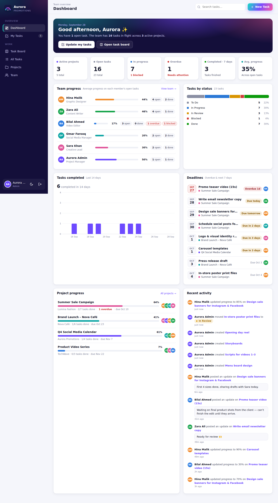
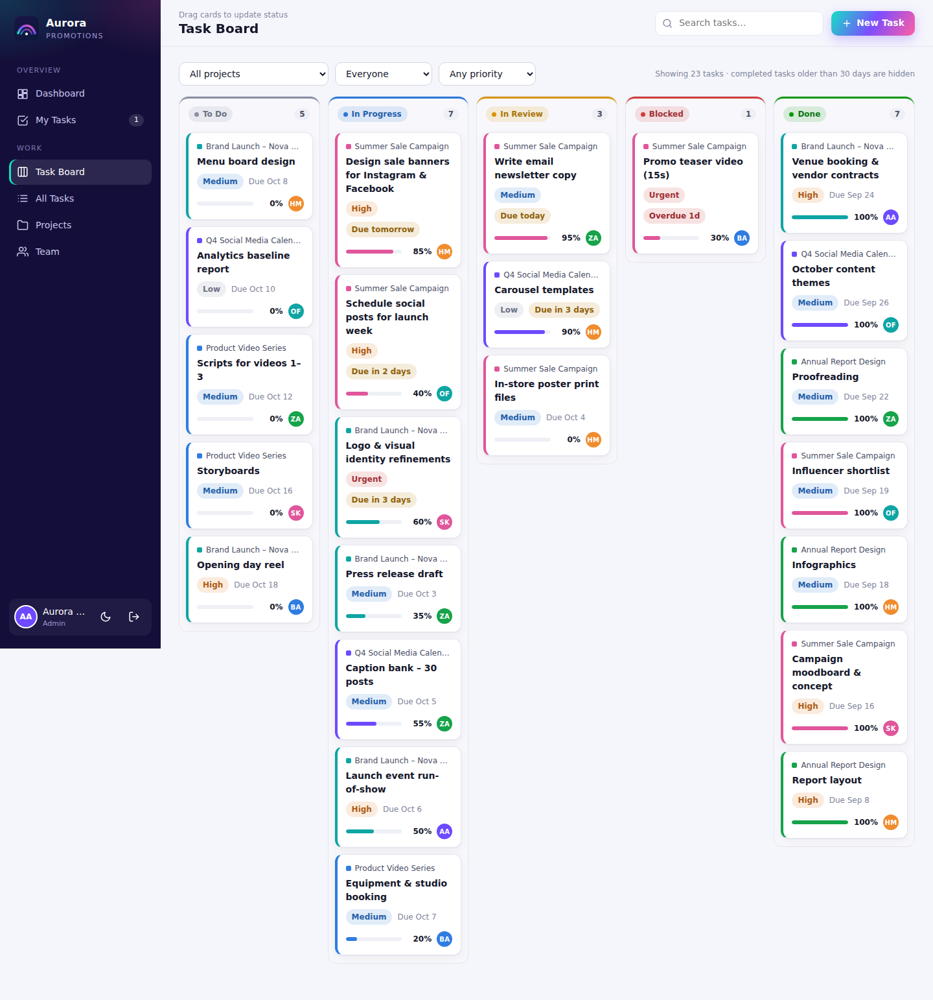
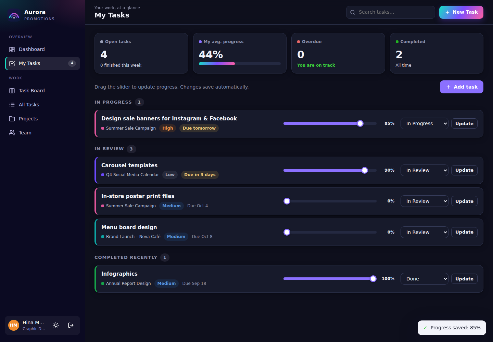

# Aurora Promotions · Team Tracker

A simple, professional project-management tool for **Aurora Promotions**. It lets managers see
how every team member is progressing on their tasks, and lets team members update their work in
one tap.



## Features

| | |
|---|---|
| **Dashboard** | Headline numbers (active projects, open, in-progress, overdue, completed this week, average progress), **team progress** per member, tasks by status, a 14-day completion chart, upcoming deadlines, project progress and a live activity feed. |
| **My Tasks** | Each person sees only their own work, grouped as *Needs attention → In progress → To do → In review → Completed*. A progress slider and status dropdown save instantly. |
| **Task Board** | Kanban columns (To Do, In Progress, In Review, Blocked, Done) with drag & drop, filterable by project, person and priority. |
| **All Tasks** | Searchable, sortable table with filters (overdue, status, priority, person, project). |
| **Projects** | Client projects with colour, lead, dates, status and automatic progress. Each project page shows its tasks and who is contributing. |
| **Team** | A card per member showing progress, open/overdue counts and workload (Available / Light / Balanced / Heavy). A profile page lists their current tasks and recent activity. |
| **Task details** | Description, dates, estimate, priority, status, progress (slider + quick 25/50/75/100%), an optional progress note and a comment thread. |
| **Roles** | **Admins** manage members, projects and all tasks. **Team members** update tasks assigned to them, add their own tasks and comment on any task. |
| **Nice touches** | Light & dark mode, mobile-friendly layout, auto-refresh every 30 s, press **N** for a new task, secure logins (hashed passwords, HTTP-only cookies). |

<p>
  
  
</p>

## Getting started

Requires **Node.js 18+**. There are no packages to install.

```bash
npm start            # starts at http://localhost:3000
```

On the very first run an admin account is created:

- **Email:** `admin@aurorapromotions.com`
- **Password:** `aurora123`: change it right away under **My Profile**.

(Or set `ADMIN_EMAIL` / `ADMIN_PASSWORD` env vars before the first start.)

Then go to **Team → Add team member** to invite your team, **Projects → New project** to create
a client project, and start adding tasks.

### Try it with sample data

```bash
npm run demo
```

This **replaces all data** with a sample team, projects and tasks and starts the server.
Log in as `admin@aurorapromotions.com / aurora123` or as a team member such as
`hina@aurorapromotions.com / team123`.

## How the team uses it (daily routine)

1. Open **My Tasks**.
2. Drag the progress slider on each task you worked on, and change status when needed
   (e.g. *In Review* when ready, *Blocked* if waiting on someone).
3. Click **Update** to add a short note ("Finished 4 banner sizes, waiting on client logo").
4. Managers watch the **Dashboard** and **Team** pages to see progress, overdue and blocked work.

## Configuration

| Variable | Default | Purpose |
|---|---|---|
| `PORT` | `3000` | HTTP port |
| `HOST` | `0.0.0.0` | Bind address |
| `DATA_DIR` | `./data` | Where `db.json` is stored |
| `ADMIN_EMAIL` / `ADMIN_PASSWORD` | see above | First-run admin account |
| `COOKIE_SECURE` | unset | Set to `1` when served over HTTPS |

## Deploying

It's a single Node process, so it runs on any small VPS, Render, Railway, Fly.io, etc.
Make sure `DATA_DIR` points to **persistent storage** and back up `data/db.json` regularly.
Put it behind HTTPS and set `COOKIE_SECURE=1`.

## Project structure

```
server.js            REST API, auth, JSON storage, static file server
public/index.html    App shell
public/app.js        Front-end (dashboard, board, tasks, projects, team, modals)
public/styles.css    Aurora brand theme (light + dark)
public/logo.svg      Aurora Promotions mark
scripts/seed-demo.js Sample data generator
```
